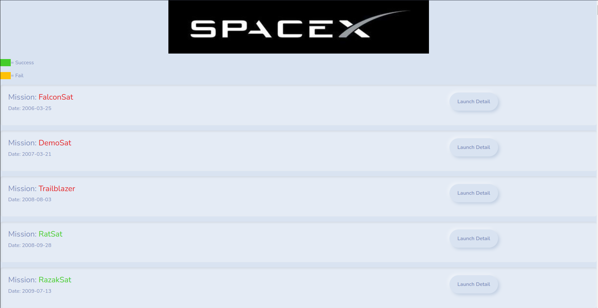
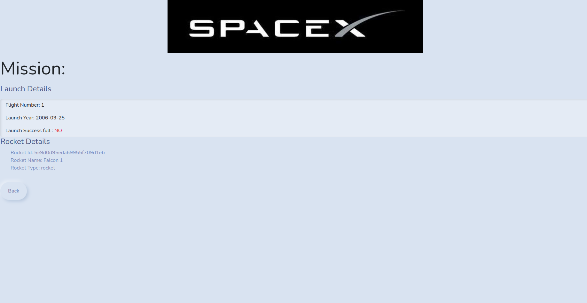

# SpaceX vue app
A mini vuejs project to fetch and display the list of launches and their details using graphql apollo.
Design using bootswatch for css template and theme

Checkout [server](https://github.com/AashisMhj/node-apps/tree/main/spacex) for backend. And same app in [react](https://github.com/AashisMhj/react-apps/tree/main/spacex)

## Packages used
1. graphql : For writing graphql queries
1. moment: Date formatting
1. apollo/client: Query Interface provider
1. vue-router: For routing

## ScreenShots

